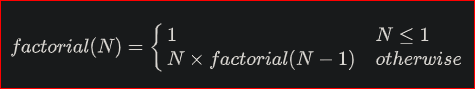

# DAY 10
## Objective
Today, we are learning about an algorithmic concept called recursion. Check out the 
[Tutorial](https://www.hackerrank.com/challenges/30-recursion/tutorial) tab for learning materials and an instructional 
video.

## Recursive Method for Calculating Factorial

## Function Description
Complete the factorial function in the editor below. Be sure to use recursion.

factorial has the following parameter:

- int n: an integer
## Returns

- int: the factorial of _**n**_

*Note:* If you fail to use recursion or fail to name your recursive function factorial or Factorial, you will get a 
score of  _**0**_.

## Input Format

A single integer,  _**n**_ (the argument to pass to factorial).

## Constraints
-  _**2 <= n <= 12**_
- Your submission must contain a recursive function named factorial.

## Sample Input

3

## Sample Output

6

## Explanation

Consider the following steps. After the recursive calls from step 1 to 3, results are accumulated from step 3 to 1.

1. _**factorial(3) = 3 x factorial(2) = 3 x 2 = 6**_
2. _**factorial(2) = 2 x factorial(1) = 2 x 1 = 2**_
3. _**factorial(1) = 1**_

[Day ten](https://www.hackerrank.com/challenges/30-recursion/problem?isFullScreen=true).