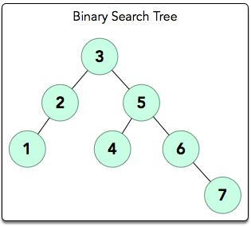
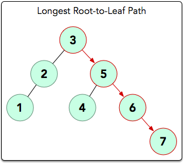

# DAY 22
## Objective
Today, we're working with Binary Search Trees (BSTs). Check out the 
[Tutorial](https://www.hackerrank.com/challenges/30-binary-search-trees/tutorial) tab for learning materials and an 
instructional video!

## Task
The height of a binary search tree is the number of edges between the tree's root and its furthest leaf. You are given a
pointer, _**root**_, pointing to the root of a binary search tree. Complete the getHeight function provided in your
editor so that it returns the height of the binary search tree.

## Input Format

The locked stub code in your editor reads the following inputs and assembles them into a binary search tree:

The first line contains an integer, _**n**_, denoting the number of nodes in the tree.

Each of the  subsequent lines contains an integer, _**n**_, denoting the value of an element that must be added to the 
BST.

## Output Format

The locked stub code in your editor will print the integer returned by your getHeight function denoting the height of 
the BST.

## Sample Input
````
7
3
5
2
1
4
6
7
````

## Sample Output
````
3
````

## Explanation

The input forms the following BST:



The longest root-to-leaf path is shown below:



There are  nodes in this path that are connected by  edges, meaning our BST's . Thus, we print  as our answer.

[Day twenty-two](https://www.hackerrank.com/challenges/30-binary-search-trees/problem?isFullScreen=true)