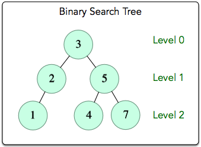

# DAY 24
## Objective
Today, we're going further with Binary Search Trees. Check out the 
[Tutorial](https://www.hackerrank.com/challenges/30-binary-trees/tutorial) tab for learning materials and an 
instructional video!

## Task
A level-order traversal, also known as a breadth-first search, visits each level of a tree's nodes from left to right,
top to bottom. You are given a pointer, _**root**_, pointing to the root of a binary search tree. Complete the 
levelOrder function provided in your editor so that it prints the level-order traversal of the binary search tree.

**Hint:** You'll find a queue helpful in completing this challenge.

## Function Description

Complete the levelOrder function in the editor below.

levelOrder has the following parameter:
- Node pointer root: a reference to the root of the tree

## Prints
- Print node.data items as space-separated line of integers. No return value is expected.

## Input Format

The locked stub code in your editor reads the following inputs and assembles them into a BST:

The first line contains an integer, _**T**_ (the number of test cases).

The _**T**_ subsequent lines each contain an integer, _**data**_, denoting the value of an element that must be added to
the BST.

## Constraints
_**1 <= N <= 20**_

_**1 <= node.data[i] <= 100**_

## Output Format
Print the _**data**_ value of each node in the tree's level-order traversal as a single line of _**N**_ space-separated
integers.

## Sample Input
````
6
3
5
4
7
2
1
````

## Sample Output
````
3 2 5 1 4 7 
````

## Explanation
The input forms the following binary search tree:



We traverse each level of the tree from the root downward, and we process the nodes at each level from left to right. 
The resulting level-order traversal is _**3 -> 2 -> 1 -> 4 -> 7**_, and we print these data values as a single line of 
space-separated integers.

[Day twenty-four](https://www.hackerrank.com/challenges/30-binary-trees/problem?isFullScreen=true).
