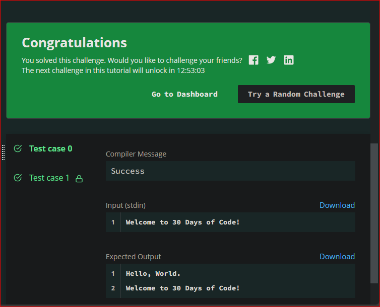

# 30 DAYS OF CODE of HackerRank
## By AndreiGatoCB

This is my 30 days of code challenge, I'll work on this for 30 days to improve my code skills, here I'll add the proves 
of my progress and talk about all the things that I didn't know before.

### Day 1
The day one helped me to understand the _**#TODO**_ tags and why you can't _commit and push_ your repository, so, you
have to edit the tag to be able to _commit and push_ your progress.

_This is the test result of my first day of the challenge_

### Day 2
The day two talks about the difference between an integer, a float number and a string. It has two possible correct
answers, and both of them are in my code, one as a comment and the another as the final code that I drop on HackerRank.

_This is the test result of my second day of the challenge_

### Day 3
The day three gives a problem where you have to create a tip and tax calculator, creating the first function of this 30 
days challenge. I tried to use ``return`` in my code, but as the challenge solicitation was to print the price, it 
doesn't work, so I turn it to print, and it works as it should.

_This is the test result of my third day of the challenge_

### Day 4
The day four it's about the conditionals, I use the ``if`` statement and try with the ``elif`` statement too and the 
``else`` statement to use it when the first condition isn't True. Also, when I tried the first submit it shows me an 
error because of the test with the _**20**_, so I had to change the ``elif 6 < n < 20:`` for ``elif 6 < n <= 20:`` and 
it works pretty well.

_This is the test result of my fourth day of the challenge_

### Day 5
This day was about Classes, here the task talk about to calculate the stage of life of a person and be able to add years
to the ages that was given. It was fun to try to put all the conditions and make it run with just one Class every time 
it was needed, I had a typo error and I didn't understand why it wasn't success, because I had all the answers as the 
sample output, but then I found the typo error and it runs perfect.

_This is the test result of my fifth day of the challenge_

### Day 6
In this day I worked with loops, I used a for loop to create a string and return the whole string and print it in once 
all the string. I like the challenge about get the first 10 multiples of a number and don't count the 0 in them, that 
was the complicated part, but I solved that bug fast and easy.

_This is the test result of my sixth day of the challenge_

### Day 7
Day 7 give us a challenge without a clue, but I write all the code, first time in this course using the ``while`` loop, 
I use to check the many times we can test a word, so it works pretty well.

_This is the test result of my seventh day of the challenge_

### Day 8
This challenge was funny, I learnt that if you put an input as an array, and you put the elements separated with a space
the array is going to get them as different elements of the array, that was the hard part of the challenge. First I 
tried to convert the array as a string, but then I find out that about the spaces and change a bit my code, so it run 
successfully.

_This is the test result of my eighth day of the challenge_

### Day 9
This was the hardest challenge yet, I tried some solutions and always get this runtime error on test case 1, at first I 
didn't understand what did I do wrong, after that I found out that the problem was about the number of entries in the
names input for the searching numbers, then I used the try-except block to break the loop when the EOFError (End Of 
File Error) were activated, so that make it ran successfully the code and get the expected result.

_This is the test result of my ninth day of the challenge_

### Day 10
Day ten had the recursive function challenge. It was harder than I thought. At first, I didn't understand how to make 
the loop works as well, but then I understood that what I needed was a function that ran inside itself, and that make it
run as it should.

_This is the test result of my tenth day of the challenge_

### Day 11
On day eleven I used a class, so I can give it an entire, convert it to binary as a string, then, I created a function 
in the class that count the consecutive 1's and return that number.

_This is the test result of my eleventh day of the challenge_

### Day 12
In this challenge I used 3 loops to create an array of the hour_glass, and then make a sum of the terms that are valid 
to the hor glass (all but first and third of the second line). At first I tried to compare the sum_arr with the new one
and take the max of them as the printable value, but in the submit code it shows me 3 tests as fails, so, I change the 
process and make a list with those results and the print the max value of that list. That make the code run 
successfully.

_This is the test result of my twelfth day of the challenge_

### Day 13
Day thirteen was about the inheritance of the classes, so it has to get a relation between the principal class
(superclass) and a secondary class (subclass), using the ``super()`` function in the secondary class it is possible 
and make it work as it should.

_This is the test result of my thirteenth day of the challenge_

### Day 14
This challenge was about abstract classes. The abstract classes talk about abstract methods, that are decorators that 
permits to a parent class to run a function of its child class, so in the parent class the function should be created 
empty, then in the child class you have to create a function that do what you want to do with the abstract method.

_This is the test result of my fourteenth day of the challenge_

### Day 15
At this challenge I had to get the absolute difference between all the numbers on an array. I solve this challenge using
a loop in a loop and removing the first element of the array when it ends the second loop run. Then when the first loop 
finally ends it gets the max number of a list created in the loops. Then as it is a variable created on the function it 
has to call the function before print it.

_This is the test result of my fifteenth day of the challenge_

### Day 16
On day sixteen I didn't know anything about 'linked lists'. Now I understand that they are lists where their values
(nodes) are linked to the very next value. Then I try to complete the method 'insert()'. First it needs a new node. Then 
it has to check if head exists, if not get the new node as the return. Next the head is marked as the current element 
and check if current has a 'next' attribute. Then the code assign the 'new node' to the current.next. Finally it returns
'head' that is the element that the display method needs to work as it's needed.

_This is the test result of my sixteenth day of the challenge_

### Day 17
Well, this day was not so hard, but it has a problem when the tester compile the code, so you have to delete the 
``if __name__ == '__main__':`` line of code, then run the code and it shows the 'SUCCESS' message. With the 
``if __name__ == '__main__':`` line of code the outputs were as they should. I don't understand why is that error in the 
compiler, but I solve it that way.

_This is the test result of my seventeenth day of the challenge_

You can try this challenge at [_**HackerRank**_](https://www.hackerrank.com/domains/tutorials/30-days-of-code).
